[TOC]
---
# 总览
文本生成目前的一大瓶颈是如何客观，准确的评价机器生成文本的质量。一个好的评价指标（或者设置合理的损失函数）不仅能够高效的指导模型
拟合数据分布，还能够客观的让人评估文本生成模型的质量，从而进一步推动text generation 商业化能力。

然而由于语言天生的复杂性和目前技术限制，我们目前还没有一个完美的评价指标。

本文就三方面对文本生成的评价指标介绍：

- 介绍了以BLEU为代表的基于统计的文本评价指标；
- 就data to text 和image caption 进一步介绍了其特有的评价模式；
- 基于bert等预训练模型的文本评价指标。


# 基于词重叠率的方法

## 机器翻译 & 摘要 常用指标
基于词重叠率的方法是指基于词汇的级别计算模型的生成文本和人工的参考文本之间的相似性，比较经典的代表有BLEU、METEOR和ROUGE，其中BLEU和METEOR常用于机器翻译任务，ROUGE常用于自动文本摘要。
### BLEU
BLEU （Bilingual Evaluation Understudy，双语评估辅助工具）可以说是所有评价指标的鼻祖，它的核心思想是比较候选译文和参考译文里的 n-gram 的重合程度，重合程度越高就认为译文质量越高。unigram用于衡量单词翻译的准确性，高阶n-gram用于衡量句子翻译的流畅性。 实践中，通常是取N=1~4，然后对进行加权平均。
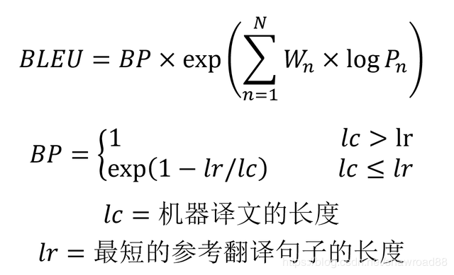
- BLEU 需要计算译文 1-gram，2-gram，...，N-gram 的精确率，一般 N 设置为 4 即可，公式中的 Pn 指 n-gram 的精确率。
- Wn 指 n-gram 的权重，一般设为均匀权重，即对于任意 n 都有 Wn = 1/N。
- BP 是惩罚因子，如果译文的长度小于最短的参考译文，则 BP 小于 1。
- BLEU 的 1-gram 精确率表示译文忠于原文的程度，而其他 n-gram 表示翻译的流畅程度。 

不过BLEU对词重复和短句有着非常不好的表现，所以改进的BLEU分别使用 **改进的多元精度（n-gram precision）** 和**短句惩罚因子**进行了优化。

#### 改进的多元精度（n-gram precision）
假设机器翻译的译文C和一个参考翻译S1如下：
> C: a cat is on the table  
S1: there is a cat on the table

   则可以计算出 1-gram，2-gram，... 的精确率（*[参考文献](https://blog.csdn.net/shawroad88/article/details/105639148)里写的是准确率(accuracy),我理解是写错了，此处应该是精确率(precision)*）

p1  计算 a cat is on the table 分别都在参考翻译S1中 所以 p1 = 1

    p2   (a, cat)在, (cat is) 没在,  (is on) 没在, (on the) 在, (the table)在  所以p2 = 3/5

    p3   (a cat is)不在,  (cat is on)不在, (is on the)不在, (on the table)在  所以 p3 = 1/4 

    依次类推(上面的在或者不在, 说的都是当前词组有没有在参考翻译中)。直接这样算, 会存在很大的问题. 例如:
>  C: there there there there there  
S1: there is a cat on the table

 这时候机器翻译的结果明显是不正确的，但是其 1-gram 的 Precision 为1，因此 BLEU 一般会使用修正的方法。给定参考译文S1,S2, ...,Sm，可以计算C里面 n 元组的 Precision，计算公式如下：

 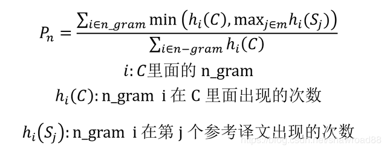
 针对上面的例子  p1 = 1/5   (因为there在C和S1中都出现了 我们按最少的次数来)

#### 惩罚因子
 上面介绍了 BLEU 计算 n-gram 精确率的方法， 但是仍然存在一些问题，当机器翻译的长度比较短时，BLEU 得分也会比较高，但是这个翻译是会损失很多信息的，例如：
 > C: a cat   
 S1: there is a cat on the table 

 因此需要在 BLEU 分数乘上惩罚因子

 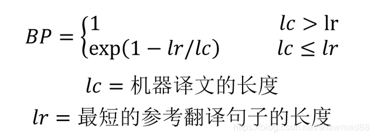

#### 优点
- 它的易于计算且速度快，特别是与人工翻译模型的输出对比；
- 它应用范围广泛，这可以让你很轻松将模型与相同任务的基准作对比。
#### 缺点
- 它不考虑语义，句子结构
- 不能很好地处理形态丰富的语句（BLEU原文建议大家配备4条翻译参考译文）
-  BLEU 指标偏向于较短的翻译结果（brevity penalty 没有想象中那么强）

### ROUGE
英文全称Recall-Oriented Understudy for Gisting Evaluation，可以看做是BLEU 的改进版，专注于**召回率而非精度**。换句话说，它会查看有多少个参考译句中的 n 元词组出现在了输出之中。

ROUGE大致分为四种（常用的是前两种）：
- ROUGE-N （将BLEU的精确率优化为召回率）
- ROUGE-L （将BLEU的n-gram优化为公共子序列）
- ROUGE-W （将ROUGE-L的连续匹配给予更高的奖励）
- ROUGE-S  （允许n-gram出现跳词(skip)）

ROUGE 用作机器翻译评价指标的初衷是这样的：在 SMT（统计机器翻译）时代，机器翻译效果稀烂，需要同时评价翻译的准确度和流畅度；等到 NMT （神经网络机器翻译）出来以后，神经网络脑补能力极强，翻译出的结果都是通顺的，但是有时候容易瞎翻译。

ROUGE的出现很大程度上是为了解决NMT的漏翻问题（低召回率）。所以 ROUGE 只适合评价 NMT，而不适用于 SMT，因为它不管候选译文流不流畅

#### ROUGE-N
“N”指的是N-gram，其计算方式与BLEU类似，只是BLEU基于精确率，而ROUGE基于召回率。

ROUGE-N 主要统计 N-gram 上的召回率，对于 N-gram，可以计算得到 ROUGE-N 分数，计算公式如下： 
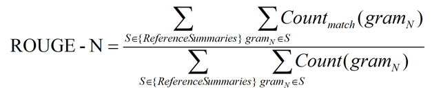
公式的分母是统计在参考译文中 N-gram 的个数，而分子是统计参考译文与机器译文共有的 N-gram 个数。

> C: a cat is on the table  
S1: there is a cat on the table

上面例子的 ROUGE-1 和 ROUGE-2 分数如下：

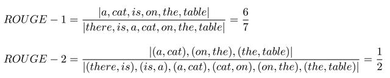
如果给定多个参考译文 Si，Chin-Yew Lin 也给出了一种计算方法，假设有 M 个译文 S1, ..., SM。ROUGE-N 会分别计算机器译文和这些参考译文的 ROUGE-N 分数，并取其最大值，公式如下。这个方法也可以用于 ROUGE-L，ROUGE-W 和 ROUGE-S。  

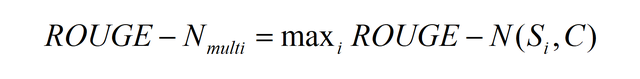


#### ROUGE-L

ROUGE-L 中的 L 指最长公共子序列 (longest common subsequence, LCS)，ROUGE-L 计算的时候使用了机器译文C和参考译文S的最长公共子序列，计算公式如下：

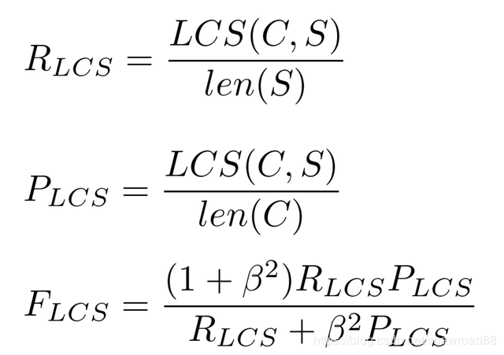

 公式中的 RLCS 表示召回率，而 PLCS 表示精确率，FLCS 就是 ROUGE-L。一般 beta 会设置为很大的数，因此 FLCS 几乎只考虑了 RLCS (即召回率)。注意这里 beta 大，则 F 会更加关注 R，而不是 P，可以看下面的公式。如果 beta 很大，则 PLCS 那一项可以忽略不计。

#### ROUGE-W

ROUGE-W 是 ROUGE-L 的改进版，考虑下面的例子，X表示参考译文，而Y1，Y2表示两种机器译文。

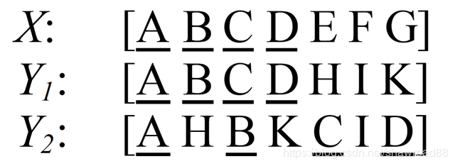

在这个例子中，明显 Y1的翻译质量更高，因为 Y1 有更多连续匹配的翻译。但是采用 ROUGE-L 计算得到的分数确实一样的，即 ROUGE-L(X, Y1)=ROUGE-L(X, Y2)。  因此作者提出了一种加权最长公共子序列方法 (WLCS)，给连续翻译正确的更高的分数，具体做法可以阅读原论文《ROUGE: A Package for Automatic Evaluation of Summaries》

#### ROUGE-S  
 ROUGE-S 也是对 N-gram 进行统计，但是其采用的 N-gram 允许"跳词 (Skip)"，即跳跃二元组（skip bigram）。例如句子 "I have a cat" 的 Skip 2-gram 包括 (I, have)，(I, a)，(I, cat)，(have, a)，(have, cat)，(a, cat)。

跳跃二元组是句子中有序的单词对，和LCS类似，在单词对之间，单词可能被跳过。比如一句有4个单词的句子，按照排列组合就可能有6种跳跃二元组。

再次使用精度和召回率来计算F，将句子Sij中跳跃二元组的个数记为 $$f_{k}\left(s_{i j}\right)$$ ，则计算公式如下:

$$\begin{array}{l}
R_{s}=m a x_{j} \frac{\sum_{k} \min \left(f_{k}\left(c_{i}\right), f_{k}\left(s_{i j}\right)\right)}{\sum_{k} f_{k}\left(s_{i j}\right)} P_{s}=\max _{j} \frac{\sum_{k} \min \left(f_{k}\left(c_{i}\right), f_{k}\left(s_{i j}\right)\right)}{\sum_{k} f_{k}\left(c_{i}\right)} \\
\operatorname{ROUGE}_{S}\left(c_{i}, S_{i}\right)=\frac{\left(1+\beta^{2}\right) R_{s} P_{s}}{R_{s}+\beta^{2} P_{s}}
\end{array}$$

### NIST
NIST(National Institute of standards and Technology)方法是在BLEU方法上的一种改进。

最主要的是引入了**每个n-gram的信息量(information)** 的概念。BLEU算法只是单纯的将n-gram的数目加起来，而nist是在得到信息量累加起来再除以整个译文的n-gram片段数目。这样相当于对于一些**出现少的重点的词权重就给的大了。**

信息量的计算公式是：

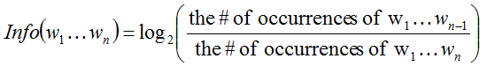

解释一下：分母是n元词在参考译文中出现的次数，分子是对应的n-1元词在参考译文中的出现次数。对于一元词汇，分子的取值就是整个参考译文的长度。这里之所以这样算，应该是考虑到出现次数少的就是重点词这样的一个思路。

计算信息量之后，就可以对每一个共现n元词乘以它的信息量权重，再进行加权求平均得出最后的评分结果：
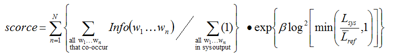

这里注意几个地方：

1、N一般取5

2、β是一个常数，在Lsys/Lref=2/3 时，β使得长度罚分率为0.5，它是个经验值，大概的曲线是：

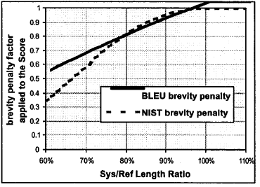

3、Lref 是参考答案的平均长度（注意L的上方有一个平均符号）

4、Lsys是译文的长度

参考链接：[机器翻译评测——BLEU改进后的NIST算法](https://www.cnblogs.com/by-dream/p/7765345.html).博客还详细介绍了如何使用nist去评测，感兴趣的同学可以看看。

### METEOR
和BLEU不同，METEOR同时考虑了基于整个语料库上的准确率和召回率，而最终得出测度。

METEOR也包括其他指标没有发现一些其他功能，如**同义词匹配**等。METEOR用 WordNet 等知识源扩充了一下同义词集，同时考虑了单词的词形（词干相同的词也认为是部分匹配的，也应该给予一定的奖励，比如说把 likes 翻译成了 like 总比翻译成别的乱七八糟的词要好吧？）

**在评价句子流畅性的时候，用了 chunk 的概念**（候选译文和参考译文能够对齐的、空间排列上连续的单词形成一个 chunk，这个对齐算法是一个有点复杂的启发式 beam serach），chunk 的数目越少意味着每个 chunk 的平均长度越长，也就是说候选译文和参考译文的语序越一致。

最后，METEOR计算为对应最佳候选译文和参考译文之间的准确率和召回率的调和平均：

$$\begin{array}{c}
\operatorname{Pen}=\gamma\left(\frac{c h}{m}\right)^{\theta} \\
F_{\text {mean }}=\frac{P_{m} R_{m}}{\alpha P_{m}+(1-\alpha) R_{m}} \\
P_{m}=\frac{|m|}{\sum_{k} h_{k}\left(c_{i}\right)} \\
R_{m}=\frac{|m|}{\sum_{k} h_{k}\left(s_{i j}\right)} \\
\text { METEOR }=(1-\operatorname{Pen}) F_{\text {mean }}
\end{array}$$

#### 理解
看公式总是挺抽象的，下面我们还是看看来自维基百科的例子吧。计算的最基本单元是句子。算法首先从待评价字符串和参考字符串之间创建一个平面图如下：
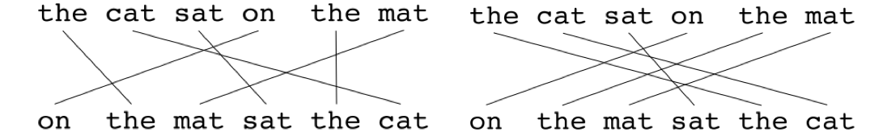

所谓**平面图**，就是1元组之间的映射集。平面图有如下的一些限制：在待评价翻译中的每个1元组必须映射到参考翻译中的1个或0个一元组，然后根据这个定义创建平面图。**如果有两个平面图的映射数量相同，那么选择映射交叉数目较少的那个。** 也就是说，上面左侧平面图会被选择。状态会持续运行，在每个状态下只会向平面图加入那些在前一个状态中尚未匹配的1元组。一旦最终的平面图计算完毕，就开始计算METEOR得分：

1元组精度： $$P=\frac{m}{w_{t}}$$
其中m是在参考句子中同样存在的，待评价句子中的一元组的数量。wt是待评价翻译中一元组的数量。

1元组召回率： $$R=\frac{m}{w_{r}}$$
m同上，是参考翻译中一元组的数量。

然后使用调和平均来计算F-mean，且召回的权重是精度的9（上面说的超参数α）倍。
$$F_{\text {mean}}=\frac{10 P R}{R+9 P}$$

到目前为止，这个方法只对单个单词的一致性进行了衡量，还没有用到为了评价流畅性的 **chunk** 。chunk 块的定义是在待评价语句和参考语句中毗邻的一元组集合。

在参考和待评价句子中的没有毗连的映射越多，惩罚就越高。为了计算惩罚，1元组被分组成最少可能的块（chunks）。在待评价语句和参考语句之间的毗邻映射越长，块的数量就越少。一个待评价翻译如果和参考翻译相同，那么就只有一个块。惩罚p的计算如下：

$$p=0.5\left(\frac{c}{u_{m}}\right)^{3}$$

（假设参数都已经设置好了）其中c就是块的数量，Um是被映射的一元组的数量。p可以减少F-mean的值。最后：
$$M=(1-p) F_{\text {mean}}$$

#### 优点
- 该方法基于一元组的精度和召回的调和平均，召回的权重比精度要高一点 ， 与人类判断相关性高
- 引入了外部知识，评价更加友好了。
#### 缺点
- 实现非常复杂，目前只有java版本
- α、γ和θ 均为用于评价的默认参数。这些都是对着某个数据集调出来的（让算法的结果和人的主观评价尽可能一致，方法我记得是 grid search）。参数一多听起来就不靠谱（给个眼神体会一下）
- 需要有外部知识。如果很多词不在wordnet，那其实就没什么意义了

### TER
TER 是 Translation Edit Rate 的缩写，是一种基于距离的评价方法，用来评定机器翻译结果的译后编辑的工作量。

这里，距离被定义为将一个序列转换成另一个序列所需要的最少编辑操作次数。操作次数越多，距离越大，序列之间的相似性越低；相反距离越小，表示一个句子越容易改写成另一个句子，序列之间的相似性越高。

TER 使用的编辑操作包括：增加、删除、替换和移位。其中增加、删除、替换操作计算得到的距离被称为编辑距离，并根据错误率的形式给出评分

$$\text { score }=\frac{\operatorname{edit}(c, r)}{l}$$

其中 edit(c,r) 是指机器翻译生成的候选译文 c 和参考译文 r 之间的距离，l 是归一化因子，通常为参考译文的长度。在距离计算中所有的操作的代价都为 1。在计算距离时，优先考虑移位操作，再计算编辑距离，也就是增加、删除和替换操作的次数。直到移位操作（[参考文献](https://opensource.niutrans.com/mtbook/section1-5.html)中还有个增加操作，感觉是笔误了）无法减少编辑距离时，将编辑距离和移位操作的次数累加得到TER 计算的距离。

> Example 1.2 
Candidate：cat is standing in the ground
Reference：The cat is standing on the ground

将 Candidate 转换为 Reference，需要进行一次增加操作，在句首增加 “The”；一次替换操作，将 “in” 替换为 “on”。所以 edit(c, r) = 2，归一化因子 l 为 Reference 的长度 7，所以该参考译文的 TER 错误率为 2/7。

与 BLEU 不同，基于距离的评价方法是一种典型的 “错误率” 的度量，类似的思想也广泛应用于语音识别等领域。在机器翻译中，除了 TER 外，还有 WER，PER 等十分相似的方法，只是在 “错误” 的定义上略有不同。需要注意的是，很多时候，研究者并不会单独使用 BLEU 或者 TER，而是将两种方法融合，比如，使用 BLEU 与TER 相减后的值作为评价指标。

## data to text 常用指标

data to text 和翻译、摘要等生成式任务最大的不同是，input是类似于table或者三元组等其他形式的数据。在评估生成结果时，我们还需要考虑文本是否准确的涵盖了data的信息。

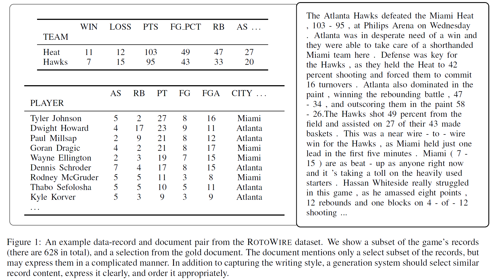

《Challenges in Data-to-Document Generation》提供了许多data to text 的评价指标，并且被后续的一些论文采用：
### relation generation (RG)
Relation generation 指从生成的句子中抽取出关系，然后对比有多少关系也出现在了source中（一般有recall和count2个指标）;
> This measures how well the system is able to generate text containing factual (i.e., correct) records.
### content selection (CS)
content selection 一般指data当中的内容有多少出现在了生成的句子中，一般有precision和recall两个指标；
> This measures how well the generated document matches the gold document in terms of selecting which records to generate.

### content ordering (CO)
content ordering 使用归一化 Damerau-Levenshtein距离计算生成句和参考句的“sequence of records(个人认为可以理解为item)”

> This measures how well the system orders the records it chooses to discuss.

### 如何实现上述的评价指标

具体到某一个任务而言（这里以ROTOWIRE数据集，篮球比赛报道为例），ROTOWIRE数据以(entity , value , type)，例如(MIAMI HEAT,95, POINTS)的形式出现。针对以下参考句：
> The Atlanta Hawks defeated the Miami Heat , 103 - 95 , at Philips Arena on Wednesday .

首先抽取出现在文本当中的(实体-值)对(例如“迈阿密热火”-95)，然后预测该对的type值是什么（正确答案应该是POINTS）。作者提到，许多信息抽取系统都是通过这样的方式把问题从多关系抽取简化为多目标分类问题，以此train一个简单的信息抽取的model。

若如此做，在test阶段就拥有一个抽取+分类的model用以评估上述指标。作者指出，他们的model拥有90%的精确率和60%的召回率，这足以支持他们来评估自己生成句子的质量。

具体实现和代码可以参照：
https://github.com/harvardnlp/data2text

### Coverage

如果你的data to text不涉及复杂的关系抽取，也可以简单的通过匹配方法来验证文本是否能够覆盖要描述的data。

>  This metric measures the average proportion of input items that are covered by a generated text. We recognized attribute values (ingredients) with string match heuristics.


### Distinct
在某些生成场景中（对话，广告文案）等，还需要追求文本的多样性。李纪为的《A diversity-promoting objective function for neural conversation models》提出了Distinct指标，后续也被许多人采用。

Distinct的定义如下：

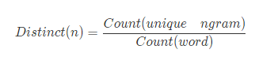
Count(unique ngram)表示回复中不重复的ngram数量,Count(word)表示回复中ngram词语的总数量。

Distinct-n越大表示生成的多样性越高。


## image caption 常用指标
### CIDEr 
CIDEr 是专门设计出来用于图像标注问题的。这个指标将每个句子都看作“文档”，将其表示成 Term Frequency Inverse Document Frequency（tf-idf）向量的形式，通过对每个n元组进行(TF-IDF) 权重计算，计算参考 caption 与模型生成的 caption 的余弦相似度，来衡量图像标注的一致性的。

- 公式
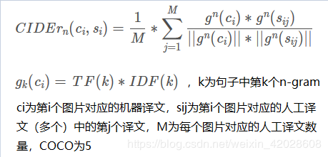

- 举例
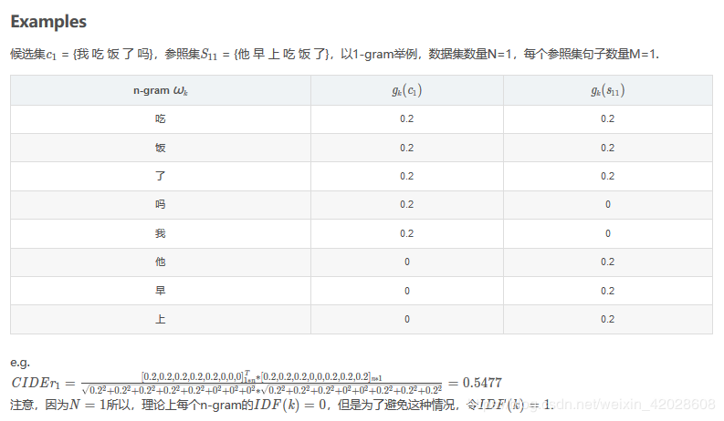

#### 好处
是一种加权的评价指标，他更关注你是否说到了重点，而常见的词权重则没有那么高。 在 [Kaustav_slides image caption](http://www.cs.toronto.edu/~fidler/slides/2017/CSC2539/Kaustav_slides.pdf)的综述里，也提到这个评价指标和人类的评价相关性更高一些。
### SPICE

SPICE 也是专门设计出来用于 image caption 问题的。全称是 Semantic Propositional Image Caption Evaluation。

我们考虑如下图片：

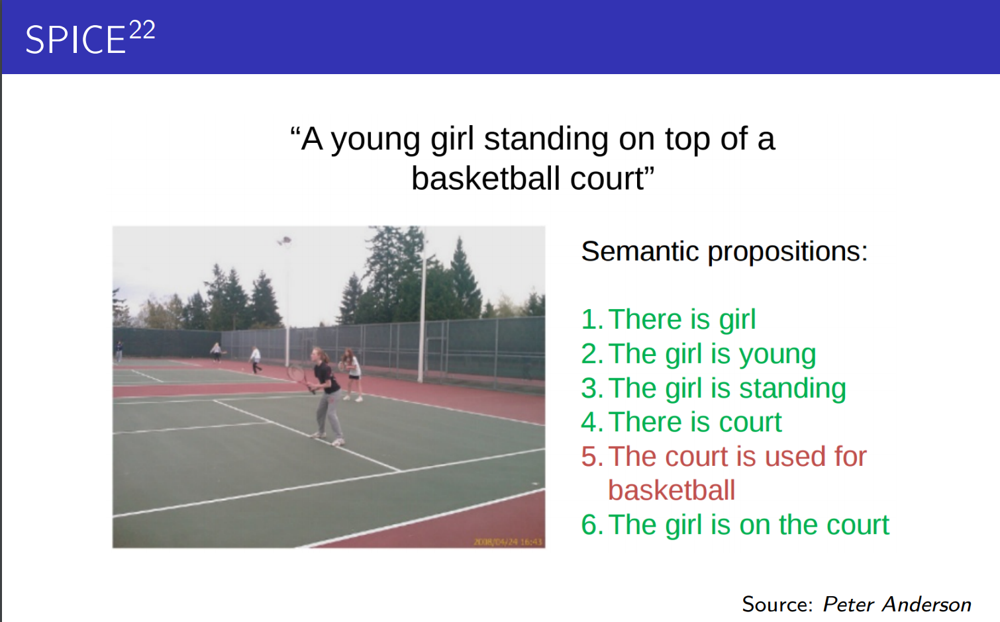

你很快会发现尽管生成的句子与参考句极为相似（只有basketball一词不一样），但我们仍认为这是一个糟糕的生成。原因在于考虑了语义的情况下，模型把网球场错误的识别成了篮球场。这个时候BLEU或者其他指标就不能很好的评价生成效果了。

SPICE 使用基于图的语义表示来编码 caption 中的 objects, attributes 和 relationships。它先将待评价 caption 和参考 captions 用 Probabilistic Context-Free Grammar (PCFG) dependency parser parse 成 syntactic dependencies trees，然后用基于规则的方法把 dependency tree 映射成 scene graphs。最后计算待评价的 caption 中 objects, attributes 和 relationships 的 F-score 值。

还是已上图为例，a young girl standing on top of a tennis court (参考句) 可以被SPICE做如下处理：
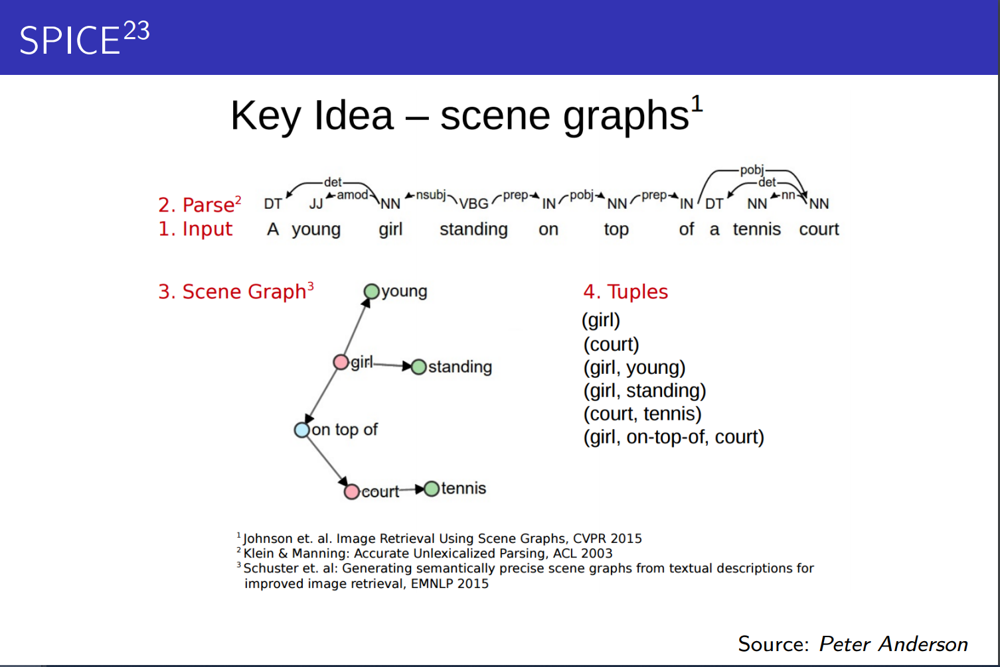
得到了若干个三元组之后，我们通过下面的公式来计算候选句c和参考句（或集合）S的得分：

$$\begin{aligned}
P(c, S) &=\frac{|T(c) \otimes T(S)|}{|T(c)|} \\
R(c, S) &=\frac{|T(c) \otimes T(S)|}{|T(S)|} \\
\operatorname{SPICE}(c, S) &=F_{1}(c, S)=\frac{2 \cdot P(c, S) \cdot R(c, S)}{P(c, S)+R(c, S)}
\end{aligned}$$

这里有一个例子：
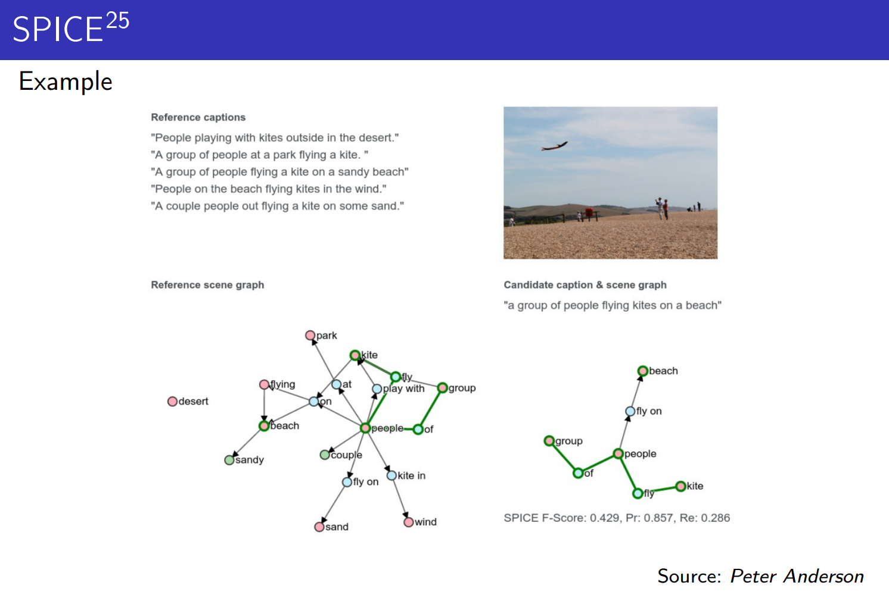

#### 好处
- 对目标，属性，关系有更多的考虑；
- 和基于n-gram的评价模式相比，有更高的和人类评价的相关性

#### 缺点
- 不考虑语法问题
- 依赖于semantic parsers ， 但是他不总是对的
- 每个目标，属性，关系的权重都是一样的（一幅画的物体显然有主次之分）

# 词向量评价指标
上面的词重叠评价指标基本上都是n-gram方式，去计算生成响应和真是响应之间的重合程度，共现程度等指标。而词向量则是通过Word2Vec、Sent2Vec等方法将句子转换为向量表示，这样一个句子就被映射到一个低维空间，句向量在一定程度上表征了其含义，在通过余弦相似度等方法就可以计算两个句子之间的相似程度。

使用词向量的好处是，可以一定程度上增加答案的多样性，因为这里大多采用词语相似度进行表征，相比词重叠中要求出现完全相同的词语，限制降低了很多。

不过说句实话，至少在我读过的paper里很少有人用（或者说只用）这种评价指标来衡量模型好坏的。作为知识拓展，这里也简单介绍一下。

## Greedy Matching
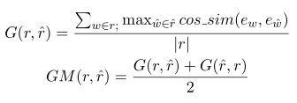
如上图所示，对于真实响应的每个词，寻找其在生成响应中相似度最高的词，并将其余弦相似度相加并求平均。同样再对生成响应再做一遍，并取二者的平均值。上面的相似度计算都是基于词向量进行的，可以看出本方法主要关注两句话之间最相似的那些词语，即关键词。
## Embedding Average
这种方法直接使用句向量计算真实响应和生成响应之间的相似度，而句向量则是每个词向量加权平均而来，如下图所示。然后使用余弦相似度来计算两个句向量之间的相似度。

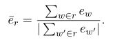
## Vector Extrema
跟上面的方法类似，也是先通过词向量计算出句向量，在使用句向量之间的余弦相似度表示二者的相似度。不过句向量的计算方法略有不同，这里采用向量极值法进行计算。


# 基于语言模型的方法 
## PPL
 它也可以用来比较两个语言模型在预测样本上的优劣。低困惑度的概率分布模型或概率模型能更好地预测样本。（例如，给定一段人写的文本，分别查看rnn和gpt-2的ppl分数如何）

注意，PPL指标是**越低**，代表语言模型的建模能力就**越好**。

给测试集的句子赋予较高概率值的语言模型较好,当语言模型训练完之后，测试集中的句子都是正常的句子，那么训练好的模型就是在测试集上的概率越高越好，公式如下：


$$PPL(W)=P\left(w_{1} w_{2} \ldots w_{N}\right)^{-\frac{1}{N}}=\sqrt[N]{\frac{1}{P\left(w_{1} w_{2} \ldots w_{N}\right.}}$$

所以当我们使用tf.contrib.seq2seq.sequence_loss()函数计算模型loss的时候，perplexity的计算就显得很简单了，直接对计算出来的loss取个指数就行了，命令如下所示：

``` python
train_perp = math.exp(float(mean_loss)) if mean_loss < 300 else math.inf
```


## 基于bert的评分指标
基于N-gram重叠的度量标准只对词汇变化敏感，不能识别句子语义或语法的变化。因此，它们被反复证明与人工评估差距较大。

近年来Bert为代表的的plm红红火火，于是有人提出使用句子上下文表示(bert全家桶)和人工设计的计算逻辑对句子相似度进行计算。这样的评价指标鲁棒性较好，在缺乏训练数据的情况下也具有较好表现。
### BERTSCORE
BERTSCORE: EVALUATING TEXT GENERATION WITH BERT , ICLR 2020
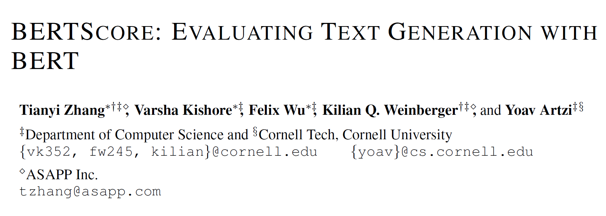

思路是非常简单的：即对两个生成句和参考句（word piece进行tokenize）分别用bert提取特征，然后对2个句子的每一个词分别计算内积，可以得到一个相似性矩阵。基于这个矩阵，我们可以分别对参考句和生成句做一个最大相似性得分的累加然后归一化，得到bertscore的precision，recall和F1：

$$R_{\mathrm{BERT}}=\frac{1}{|x|} \sum_{x_{i} \in x} \max _{\hat{x}_{j} \in \hat{x}} \mathbf{x}_{i}^{\top} \hat{\mathbf{x}}_{j}, \quad P_{\mathrm{BERT}}=\frac{1}{|\hat{x}|} \sum_{\hat{x}_{j} \in \hat{x}} \max _{x_{i} \in x} \mathbf{x}_{i}^{\top} \hat{\mathbf{x}}_{j}, \quad F_{\mathrm{BERT}}=2 \frac{P_{\mathrm{BERT}} \cdot R_{\mathrm{BERT}}}{P_{\mathrm{BERT}}+R_{\mathrm{BERT}}}$$

流程如下图所示：

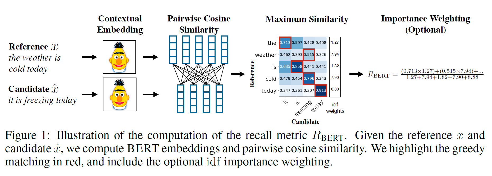

#### Importance Weighting
还可以考虑给不同的词以权重。作者使用idf函数，即给定M个参考句，词w的idf为：
$$\operatorname{idf}(w)=-\log \frac{1}{M} \sum_{i=1}^{M} \mathbb{I}\left[w \in x^{(i)}\right]$$

用此式更新上述评分，例如recall：
$$R_{\mathrm{BERT}}=\frac{\sum_{x_{i} \in x} \operatorname{idf}\left(x_{i}\right) \max _{\hat{x}_{j} \in \hat{x}} \mathbf{x}_{i}^{\top} \hat{\mathbf{x}}_{j}}{\sum_{x_{i} \in x} \operatorname{idf}\left(x_{i}\right)}$$

#### Baseline Rescaling

为了保证一个可读性（即不好的生成值为0，好的生成值为1）需要做一个Rescaling。作者的做法是随机的组合候选句和参考句（we create 1M candidate-reference pairs by grouping two random sentences.）从而计算一个b的平均值。b会被用于以下的式子：

$$\hat{R}_{\mathrm{BERT}}=\frac{R_{\mathrm{BERT}}-b}{1-b}$$

若如此做，R_BERT会被映射到0和1(typically),precision和F1也可以做相似的操作。

#### 实验设计
有大量丰富的实验验证鲁棒性和有效性。(43页的paper，模型只讲了半页)

### 拓展阅读 ： BLEURT 

BLEURT: Learning Robust Metrics for Text Generation. ACL 2020
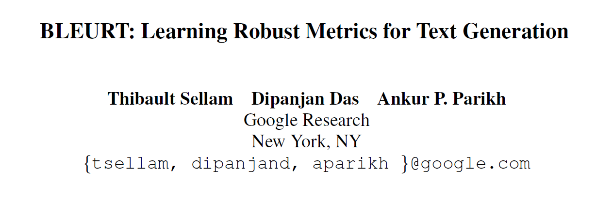

作者认为，可以通过预训练结合人工评估数据的微调来同时满足度量方法的鲁棒性和表达度。基于该思路，提出了BLEURT，一种基于BERT的文本生成任务度量方法，通过对维基百科句子的随机扰动，辅以一组词汇级和语义级的监督信号来进行预训练。

个人感觉主要和bertscore主要的区别在于：
- bertscore本质上是只利用embedding计算内积，BLEURT本质上是finetune语义相似度任务，然后用来做评价指标。

$$v_{[C L S]}, v_{x_{1}}, \ldots v_{x_{r}}, v_{x_{\tilde{1}}}, \ldots v_{x_{\tilde{p}}}=B E R T(x, \tilde{x})$$

取特殊标志[CLS]位置的向量作为句子表示，馈入一线性层，获得相似度分数：
$$\hat{y}=f(x, \tilde{x})=W \tilde{v}_{[C L S]}+b$$

- 在finetune以前，作者是通过遮盖(BERT,spanBERT)，回译(en->fr->en)，删除(30%)等方法获取扰乱句子集合，然后利用原本的句子集合和扰乱句子集合进行“模型预热”。预热的监督信息有：
    1. 其他自动指标计算方法的结果(BLEU，ROUGE，BERTscore)
    2. 回译似然度
    3. 三分类标签，判断原句和扰动句的文本关系，主要包括蕴含、矛盾、中立
    4. 回译标志，标注扰动句是否通过原句由回译过程生成

详情请看 ：《BLEURT:用于文本生成任务的鲁棒指标》阅读笔记 - Henretter的文章 - 知乎
https://zhuanlan.zhihu.com/p/129711609

### 拓展阅读 ： MoverScore
MoverScore: Text Generation Evaluating with Contextualized Embeddings and Earth Mover Distance. 
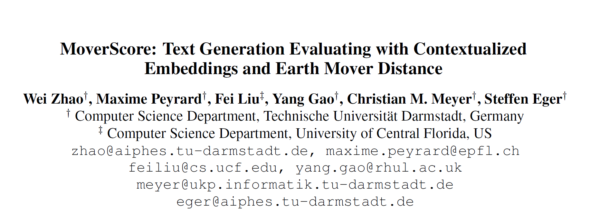

个人感觉主要和bertscore相比有2点创新：
- 采用了推土机距离计算和参考句的相似程度，而不是单纯的像bertscore只考虑最相似的词的距离。这样我觉得可以防止候选句的某一个词过于强大（离所有参考句的word都很接近，结果代替了其他候选句的词来表现）

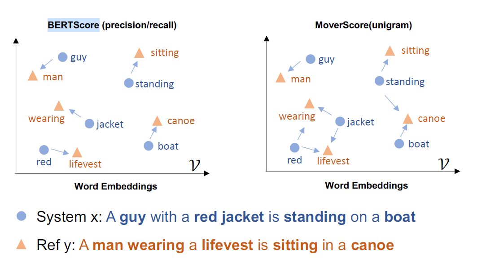

- 如何得到一个 word/n-gram 的向量表示，基于预训练的模型来得到 contextualized 表示是一个开放性的问题，Elmo和BERT都是多层结构，不同的layer包含了不同的含义。作者这里提到了两种方法，并最终采用了前者：
    1. the concatenation of power means
    2. a routing mechanism for aggregation

具体可参考博客：https://panxiaoxie.cn/2019/10/31/%E4%BB%8E0%E5%BC%80%E5%A7%8BGAN-9-metric-for-NLG/

# 总结

- BLEU，ROUGE等评价指标依然是主流的评价方式
- 从短句惩罚、重复、重要信息缺失、多样化等方面，衍生出例如METEOR、SPICE、Distinct等评价指标
- 以bertscore为代表的评价指标近年来受到广泛的关注，与人工评价的相关性也越来越高


# 参考文献
【1】文本生成任务评估指标 https://blog.csdn.net/linchuhai/article/details/90140555  
【2】 文本生成评价方法 BLEU ROUGE CIDEr SPICE Perplexity METEOR - 思婕的便携席梦思的文章 - 知乎
https://zhuanlan.zhihu.com/p/108630305  
【3】 NLP输出文本评估：使用BLEU需要承担哪些风险？https://blog.csdn.net/dQCFKyQDXYm3F8rB0/article/details/87835014  
【4】 机器翻译自动评估-BLEU算法详解 https://blog.csdn.net/qq_31584157/article/details/77709454

【5】 机器翻译, 文本生成等任务评价指标 BLEU, ROUGE, PPL(困惑度)https://blog.csdn.net/shawroad88/article/details/105639148

【6】 现在基于深度学习的对话系统常用的评价指标有哪些，分别有什么优缺点和适用范围？ - 徐阿衡的回答 - 知乎
https://www.zhihu.com/question/264731577/answer/284806491

【7】 【NLP】机器翻译常用评价标准 (BLEU & METEOR) https://blog.csdn.net/Jkwwwwwwwwww/article/details/52846728

【8】 看图说话的AI小朋友——图像标注趣谈（上） - 杜客的文章 - 知乎
https://zhuanlan.zhihu.com/p/22408033

【9】 深度学习对话系统理论篇--数据集和评价指标介绍 - 呜呜哈的文章 - 知乎 https://zhuanlan.zhihu.com/p/33088748

【10】 Anderson, Peter, et al. "Spice: Semantic propositional image caption evaluation." European Conference on Computer Vision. Springer, Cham, 2016.

【11】 Sam Wiseman, Stuart Shieber, and Alexander Rush.
2017. Challenges in data-to-document generation.
In Proceedings of the 2017 Conference on Empirical
Methods in Natural Language Processing, pages
2253–2263. Association for Computational Linguistics.

【12】 https://opensource.niutrans.com/mtbook/section1-5.html

【13】 Wiseman, Sam, Stuart M. Shieber, and Alexander M. Rush. "Challenges in data-to-document generation." arXiv preprint arXiv:1707.08052 (2017).

【14】 Li, Jiwei, et al. "A diversity-promoting objective function for neural conversation models." arXiv preprint arXiv:1510.03055 (2015).

【15】Zhang, Tianyi, et al. "Bertscore: Evaluating text generation with bert." arXiv preprint arXiv:1904.09675 (2019).

【16】 Sellam, Thibault, Dipanjan Das, and Ankur P. Parikh. "BLEURT: Learning Robust Metrics for Text Generation." arXiv preprint arXiv:2004.04696 (2020).

【17】 https://panxiaoxie.cn/2019/10/31/%E4%BB%8E0%E5%BC%80%E5%A7%8BGAN-9-metric-for-NLG/

【18】《BLEURT:用于文本生成任务的鲁棒指标》阅读笔记 - Henretter的文章 - 知乎 https://zhuanlan.zhihu.com/p/129711609

